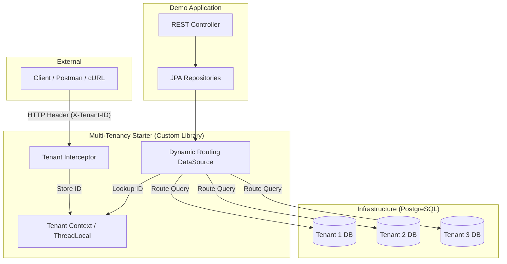
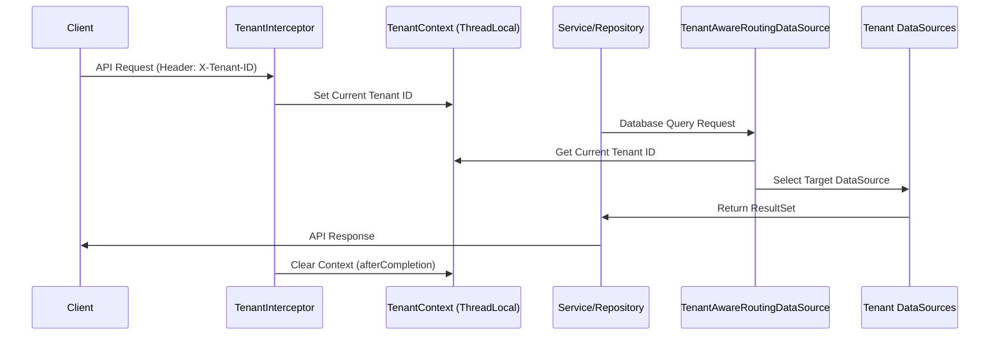

# Custom Spring Boot Starter for Multi-Tenant Data Source Routing

This repository contains a complete multi-module Maven project that delivers:

- A reusable Spring Boot starter for header-based tenant resolution and datasource routing.
- A demo application that consumes the starter and exposes tenant-aware user APIs.
- A full Docker Compose setup with PostgreSQL and automated creation of three tenant databases.

## Project Structure

```text
.
|-- multitenancy-spring-boot-starter/
|   |-- src/main/java/com/example/multitenancy/
|   |-- src/main/resources/META-INF/spring/org.springframework.boot.autoconfigure.AutoConfiguration.imports
|   `-- pom.xml
|-- demo-application/
|   |-- src/main/java/com/example/demo/
|   |-- src/main/resources/application.yml
|   |-- src/test/java/com/example/demo/UserIsolationIntegrationTest.java
|   |-- src/test/resources/application-test.yml
|   |-- Dockerfile
|   `-- pom.xml
|-- db-init/init-tenant-dbs.sh
|-- docker-compose.yml
|-- .env.example
`-- pom.xml
```

## Architecture

The project follows a **Database-per-Tenant** isolation strategy. The routing logic is decoupled into a reusable Spring Boot Starter.

### High-Level System Architecture



### Request Lifecycle & Routing Flow



### Core Logic
1.  **Resolver**: The `TenantInterceptor` extracts the tenant identifier from the incoming HTTP request headers.
2.  **Storage**: The `TenantContext` stores the identifier in a `ThreadLocal` storage, ensuring it is isolated per request thread.
3.  **Routing**: The `TenantAwareRoutingDataSource` (extending `AbstractRoutingDataSource`) dynamically determines which underlying connection pool to use for every database operation by looking up the active tenant in the context.
4.  **Isolation**: Since each tenant points to a completely different database URI, hard isolation is guaranteed.

## Module Details

### 1) `multitenancy-spring-boot-starter`

Provides:

- `TenantContext` with `ThreadLocal<String>` for request-scoped tenant identity.
- `TenantAwareRoutingDataSource` based on `AbstractRoutingDataSource`.
- `TenantInterceptor` that reads `X-Tenant-ID`, validates it, and clears context in `afterCompletion`.
- `MultiTenancyProperties` (`multitenancy.*`) binding from YAML.
- `MultiTenancyAutoConfiguration` to build all tenant datasources and register routing datasource.
- Auto-configuration registration in:
	- `src/main/resources/META-INF/spring/org.springframework.boot.autoconfigure.AutoConfiguration.imports`

### 2) `demo-application`

Consumes the starter and includes:

- `User` JPA entity and `UserRepository`.
- REST endpoints:
	- `POST /api/users`
	- `GET /api/users`
	- `GET /api/users/{id}`
- `GlobalExceptionHandler` returning clear API errors for:
	- Missing tenant header (`400 Bad Request`)
	- Unknown tenant (`404 Not Found`)
	- Missing user (`404 Not Found`)
- Custom actuator health contributor available at:
	- `GET /actuator/health/datasources`

## Configuration

Tenant configuration is driven from `demo-application/src/main/resources/application.yml`:

```yaml
multitenancy:
	enabled: true
	tenants:
		- id: tenant1
			url: jdbc:postgresql://db:5432/tenant1_db
			username: user
			password: password
		- id: tenant2
			url: jdbc:postgresql://db:5432/tenant2_db
			username: user
			password: password
		- id: tenant3
			url: jdbc:postgresql://db:5432/tenant3_db
			username: user
			password: password
```

You can override these values via environment variables documented in `.env.example`.

## Build and Run Locally

Build all modules and install the starter in your local Maven repository:

```bash
mvn clean install
```

Run the demo app directly:

```bash
mvn -pl demo-application spring-boot:run
```

## Run with Docker Compose

1. Copy `.env.example` to `.env` and adjust values if needed.
2. Start everything:

```bash
docker compose up --build
```

What starts:

- `db` service: PostgreSQL 14 with tenant DB initialization script (`db-init/init-tenant-dbs.sh`)
- `app` service: demo Spring Boot application

Health checks:

- DB uses `pg_isready`
- App uses `GET /actuator/health`

The app waits for DB health before startup via `depends_on.condition: service_healthy`.

## API Examples

Create a user for tenant1:

```bash
curl -X POST http://localhost:8080/api/users \
	-H "Content-Type: application/json" \
	-H "X-Tenant-ID: tenant1" \
	-d '{"name":"Alice","email":"alice@tenant1.io"}'
```

List users for tenant1:

```bash
curl http://localhost:8080/api/users -H "X-Tenant-ID: tenant1"
```

List users for tenant2:

```bash
curl http://localhost:8080/api/users -H "X-Tenant-ID: tenant2"
```

Get datasource health:

```bash
curl http://localhost:8080/actuator/health/datasources
```

## Testing

Integration tests are included in:

- `demo-application/src/test/java/com/example/demo/UserIsolationIntegrationTest.java`

These tests verify:

- User creation stores data in the correct tenant DB.
- Tenant-level data isolation for list/get endpoints.
- Missing `X-Tenant-ID` returns `400`.
- Unknown tenant returns `404`.
- `actuator/health/datasources` reports all tenant datasource health states.

Run tests:

```bash
mvn -pl demo-application test
```
